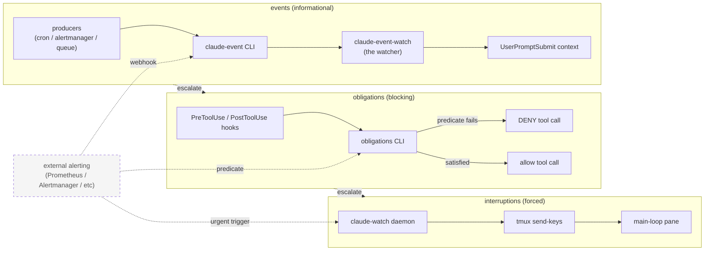

<p align="center">
  
</p>

# claude-watch

A Rust daemon that monitors [Claude Code](https://claude.ai/code) sessions running in tmux. Detects activity states, recovers from stalls, and manages the tmux layout.

## Quick start

Fresh-laptop path (Docker, no native install required):

```bash
git clone https://github.com/hndrewaall/claude-watch.git
cd claude-watch
make bootstrap              # checks prereqs, clones eichi sibling, seeds .env
# edit examples/compose/.env (set ANTHROPIC_API_KEY)
make compose-up             # docker compose up against examples/compose/
```

Open <http://localhost:8000/> for the queue UI and <http://localhost:8001/>
for semantic search. Full walkthrough (caveats, sibling-repo layout,
first-run indexing): [`examples/compose/README.md`](examples/compose/README.md).

Native install (build from source):

```bash
make build                  # cargo build --release
make install                # daemon copied + tool scripts symlinked into $BIN_DIR (default ~/bin)
make install-hooks          # opt-in: warning-free build + unit-tests pre-commit gate
```

`make help` indexes every target, grouped by which deployment shape it
belongs to (Linux host + systemd, or the container/compose stack).

Prerequisites: `cargo` + `rustc` (1.74+), `tmux`, Python 3.11+ for the
`tools/` scripts.

Agent-onboarding files at the repo root (`CLAUDE.md`, `AGENTS.md`,
`.cursorrules`, `.github/copilot-instructions.md`) all point to a single
canonical source: [`CLAUDE.md`](CLAUDE.md). Drop a coding agent in this
repo and it will know the build + test loop without further setup.

## What it does

claude-watch captures the Claude Code tmux pane every few seconds and parses it to determine what Claude is doing:

- **Activity detection**: Thinking, Writing, ToolRunning, Idle, ForegroundBash, ShellPrompt
- **Health monitoring**: Detects zombie sessions (no heartbeat), token stalls (context exhaustion), prolonged thinking, and foreground blocks
- **Recovery actions**: Injects prompts to resume stalled sessions, triggers context clears, sends push-notification alerts (via a pluggable `pingme` shim — wire it to whatever notification service you prefer)
- **Fresh session detection**: Detects when Claude Code starts fresh (via `dashboard --recreate --fresh`) and injects a resume prompt
- **Task monitoring**: Watches Claude Code's background task output files, tracks agent lifecycle, cleans up orphaned tmux panes

## Alerting hierarchy

claude-watch and its sibling tools form a three-tier alerting hierarchy. Each
tier ESCALATES if the lower one is insufficient: an **event** is informational
(noise in the next loop pass), an **obligation** BLOCKS a tool call until
satisfied, and an **interruption** CANCELS in-flight generation and forces the
main loop to handle the underlying issue immediately.

> For the **conceptual** treatment — how events, obligations, and
> interruptions *differ* (not just how they escalate), where a *watcher* (the
> one-shot `claude-event-watch`-style tool) fits as the immediate notifier
> versus an *event producer* (cron / alertmanager / queue) that feeds it (and
> why the watcher count stays near one), and why a harness-injected tool
> rejection is NOT an interruption — see
> [`docs/concepts/event-hierarchy.md`](docs/concepts/event-hierarchy.md). It is
> the entry point that ties the otherwise-scattered per-subsystem docs together.



| Tier | Mechanism | Implementation surface | Use case |
|------|-----------|------------------------|----------|
| **events** (mild) | producers + a watcher | A *producer* (cron / alertmanager / queue) emits JSON into `~/claude-events/` via the `claude-event` CLI; the `claude-event-watch` *watcher* (a one-shot, fire-and-exit tool) surfaces an `EVENT[source/tag]` one-liner in the next `UserPromptSubmit` context | Routine signaling — cron ticks, queue state changes, non-blocking alerts, completed-torrent notifications, scheduled reminders |
| **obligations** (blocking) | hooks (PreToolUse / PostToolUse) | `settings.json` hooks invoke the `obligations` CLI; predicates DENY a tool call when invariants are unmet; the agent must `obligations satisfy` or `obligations override` before retrying | Invariants and guardrails — must-ack inbox before sending, must-read captured watcher output before restarting, no-private-leakage gates, queue-spawn ordering, ack-gate enforcement |
| **interruptions** (forced) | tmux `send-keys` | The `claude-watch` Rust daemon injects directly into the main-loop tmux pane when urgency demands mid-generation intervention (context approaching limit, dead watchers, prolonged thinking >300s, zombie session) | Forced, can't-wait-for-turn-boundary intervention — situations where letting the current generation finish would make recovery harder or impossible |

### External alerting (not a fourth tier)

External alerting systems (Prometheus + Alertmanager, PagerDuty, custom
webhooks, etc.) are **not** a native tier in this hierarchy and are explicitly
out of scope for claude-watch itself. Instead, external alerting routes INTO
one of the three tiers above per use case:

- **into events** (most common): the external system POSTs a webhook that
  emits a `claude-event`, surfaced in the next `UserPromptSubmit` context.
- **into obligations**: a Prometheus alert state can drive an `obligations`
  predicate, blocking certain tool calls while the alert is firing.
- **into interruptions**: a sufficiently urgent external alert can trigger a
  claude-watch-driven tmux injection for immediate mid-generation attention.

claude-watch provides the surfaces; wire external alerting to them as
appropriate. See [`CLAUDE.md`](CLAUDE.md) for guidance on when to reach for
each tier (and when NOT to).

That said, claude-watch DOES version-control the canonical Prometheus
recording + alert **rule definitions** for its own metrics (the daemon
doesn't *run* Prometheus, but the rules encode claude-watch semantics, so
they live next to the exporters that emit the metrics rather than being
re-derived in each deployment). See
[`monitoring/prometheus/`](monitoring/prometheus/) — any stack (the local
compose, gomorrah, a hosted Prometheus) should symlink/copy that file. The
`WorkQueueOrphaned` rule is the SLOW **escalation** stage of the two-stage
owner-orphan ladder; the FAST first-line signal is the in-tree
`claude-watch queue-check` `queue-orphaned` claude-event (see
[`monitoring/prometheus/README.md`](monitoring/prometheus/README.md) and
`config.toml [queue_check]`).

The Grafana **dashboard JSON** for those same metrics is version-controlled on
the same terms, in [`monitoring/dashboards/`](monitoring/dashboards/). It is a
source of record to copy or symlink from — deliberately not something live:
never bind-mount a checkout of this repo as a Grafana dashboards volume, since
the file provisioner deletes every dashboard not present in that directory.

## Architecture

```
claude-watch (systemd service)
    |
    +-- main loop (3s interval)
    |       Captures tmux pane -> detect_activity() -> policy decisions
    |       Tracks: tokens, bashes, dead checks, thinking duration
    |
    +-- task-watch loop (5s interval)
    |       Monitors Claude Code's task output directory via inotify
    |       Tracks task lifecycle, cleans up done tasks
    |
    +-- dashboard / dashboard-refit (shell scripts)
            Creates and manages the tmux session layout
```

### Key modules

| Module | Purpose |
|--------|---------|
| `tmux.rs` | Pane capture, `detect_activity()`, key injection |
| `policy.rs` | Decision engine: when to alert, inject, recover |
| `state.rs` | Persistent state (JSON): dead checks, inject flags, history |
| `status.rs` | Status bar parsing (tokens, bashes, compact %) |
| `task_watch.rs` | Background task and agent lifecycle monitoring |
| `alert.rs` | Push notifications (via the `pingme` shim) |
| `config.rs` | TOML configuration |

### Dashboard scripts

The `dashboard` script creates a tmux session with Claude Code and optional companion panes. Layout is configured via `~/.config/dashboard/layout.conf`:

```ini
[main]
top_right = sidebar        # fixed-width right pane
sidebar_width = 25
claude_percent = 45        # claude pane height %

[windows]
monitor = glances /// htop   # extra window, panes split by ///
logs = journalctl -f         # single-pane window
```

## Hybrid hooks + daemon fallback

claude-watch ships a **hybrid model** that pairs conversational reminders
(Claude Code hooks) with the daemon's tmux-injecting fallback:

- **Primary path — hooks.** Three Claude Code hooks call
  `claude-watch hook-fire <type>` on the relevant trigger and inject a
  reminder directly into the conversation:

  | Hook | When | Reminder |
  |---|---|---|
  | `SessionStart` (`startup\|resume`) | new Claude Code version installed | "Version X → Y available, run /restart" |
  | `Stop` | context usage > 80% | "Context at N%, consider /clear" |
  | `PreCompact` (`auto`) | auto-compaction is about to run | blocks, suggests /clear |

- **Fallback path — daemon.** For each reminder, the daemon records a
  timestamped marker in `~/.cache/claude-watch/reminders/<type>.json`.
  Before the daemon falls back to injecting `/clear` or `claude update`
  via tmux, it checks whether a matching reminder fired within the
  configured grace window (default 5 min for `/clear`, 15 min for
  `claude update`). If it did, the daemon defers; if the reminder is
  stale, the daemon proceeds with the tmux fallback and bumps the
  `fallback_*_count` metric.

### Installing the hooks

See [`skills/setup-hooks.md`](skills/setup-hooks.md), installed as the
`/cw-setup-hooks` slash command by `make install-skills` (see
[Skills](#skills)). Summary:

```
/cw-setup-hooks install                  # global ~/.claude/settings.json
/cw-setup-hooks --scope project install  # .claude/settings.json
/cw-setup-hooks uninstall
```

### Tuning

```toml
# ~/.config/claude-watch/config.toml
[hybrid]
enabled = true                   # master switch (default: true)
context_fallback_secs = 300      # wait 5 min after context_high hook before /clear fallback
version_fallback_secs = 900      # wait 15 min after version_update hook before claude update fallback
```

### Observability

`claude-watch metrics` exports:

- `claude_watch_reminder_fires_total{type=...}` — how often hooks fired
  (counter, labels: `context_high`, `version_update`, `pre_compact`)
- `claude_watch_fallback_injections_total{type=...}` — how often the
  daemon fell back to tmux injection (labels: `clear`, `update`)
- `claude_watch_reminder_to_action_latency_seconds_{sum,count}{type=...}`
  — histogram-style counters for the delay between reminder and the
  self-action (context drop / version match) landing.
- `claude_code_tokens_total{type=...}` — cumulative Claude Code token
  usage (counter), aggregated from the JSONL transcripts under
  `~/.claude/projects/`. Labels: `input`, `output`, `cache_creation`,
  `cache_read`. Drives a per-day bar chart via `increase(...[1d])`.
- `claude_code_tokens_month_to_date{type=...}` — token usage for the
  current calendar month (gauge), resets on the 1st. Same `type` labels.

Ratio `fallback_injections_total / reminder_fires_total` = how often
Claude ignored the conversational hint.

## What it doesn't do

claude-watch monitors the session and recovers from failures, but it has no memory of what Claude was working on. It can detect "Claude is idle" or "Claude is stuck," but it can't tell Claude *what to resume*.

The repo also ships a set of supporting CLIs and hook scripts under
`tools/` that together with the daemon form a more complete session-
continuity layer. They live here because they're tightly coupled to the
daemon's contract (queue + obligation predicates + claude-event bus +
watcher lifecycle), and shipping them in the same public repo makes
fresh deployments self-contained.

| Subsystem | Path | Purpose |
|-----------|------|---------|
| `session-task` | [`tools/session-task/`](tools/session-task/) | Cross-session work-queue + resume-action CLI. See [`docs/queue.md`](docs/queue.md). |
| `obligations` | [`tools/obligations/`](tools/obligations/) | Generic "must do X before Y" gate; bounded predicate vocabulary. The `event_must_act` instance is the event-reading enforcement layer — see [`docs/event-must-act.md`](docs/event-must-act.md). |
| Hook scripts | [`tools/hooks/`](tools/hooks/) | PreToolUse / PostToolUse hooks that wire the queue + obligations gate into Claude Code's hook contract. See [`docs/hooks.md`](docs/hooks.md). |
| `agent-msg` | [`tools/agent-msg/`](tools/agent-msg/) | Async-messaging CLI for delivering inbox messages to running subagents via the obligations gate. See [`docs/agent-msg.md`](docs/agent-msg.md). |
| `claude-event` + `claude-event-tail` | [`tools/claude-event/`](tools/claude-event/) | Source-agnostic JSON event bus (emitter + ring-buffer reader). See [`docs/events.md`](docs/events.md), and [`docs/concepts/event-hierarchy.md`](docs/concepts/event-hierarchy.md) for how events relate to obligations and interruptions. |
| `claude-event-watch`, `self-clear`, `self-login` | [`tools/watchers/`](tools/watchers/) | Watcher script (inotify-blocking event surfacer), the `/clear` + resume-prompt injector, and the on-demand `/login` driver that scrapes the OAuth URL out of the pane and takes the authorization code back. See [`docs/watchers.md`](docs/watchers.md) for operator hygiene and [`docs/adding-watchers.md`](docs/adding-watchers.md) for authoring a custom watcher. |
| `queue-minisite` | [`queue-minisite/`](queue-minisite/) | Mobile-friendly Flask UI for the `session-task` work queue. Renders running/pending/blocked items with Stop / Abandon / Force-start buttons. Designed to sit behind an upstream auth proxy. See [`queue-minisite/README.md`](queue-minisite/README.md). |
| `container` | [`container/`](container/) | Containerized deployment of Claude Code + the `claude-watch` daemon + tmux as a single Docker image, plus a host-side `claude-tmux` wrapper with bind mounts, env passthrough, POSIX signal handling, and TTY. Lets the same Claude Code environment run identically on Linux servers and macOS work laptops. See [`container/README.md`](container/README.md). |

`make install` builds the daemon and copies all of the above into
`$BIN_DIR` (default `~/bin/`). Each subsystem has its own README, tests
under `tests/`, and a public-facing reference doc in `docs/`.

What the daemon plus tools still don't cover by design: a host-specific
resume checklist, a request tracker, external messaging integrations,
and any other site-specific surface. Those belong in your own dotfiles
or ops repo and call into these tools as primitives.

## Build & run

`make help` prints the full index, grouped into sections — the test suites
(split by where the code under test lives), the Linux host build/install and
systemd deploy, the container/compose deploy, and the macOS host helpers.
The commonly used ones:

```bash
make test                # all Rust tests in parallel
make test-session-task   # session-task pytest suite
make test-hooks          # obligations + queue PreToolUse hook tests
make test-queue-minisite # queue-minisite Flask end-to-end suites
make test-agent-msg      # agent-msg embedded --test suite
make test-claude-event   # claude-event + claude-event-tail unit tests
make test-watchers       # claude-event-watch fast-path + self-clear/self-login

make build               # release build
make install             # build; copy daemon + symlink tool scripts into $BIN_DIR (default ~/bin/)
make deploy-systemd      # build + install skills + systemctl restart (host/systemd install)
make install-skills      # install skills/ as /cw-<name> slash commands (dep of deploy-systemd)
make install-hooks       # install the git pre-commit hook (warnings + tests)
make test-install-host-skills  # tests for the skills installer + its Makefile wiring
```

Deploying the container ("workbot") shape instead is `make deploy-container`
— see [`examples/compose/README.md`](examples/compose/README.md).

### Skills

Slash commands ship in two dirs, and everything from this repo is **prefixed**
so it is always distinguishable from a skill you wrote yourself:

| Dir | Scope | Host deploy | Container |
| --- | --- | --- | --- |
| [`skills/`](skills/) | works in any deployment | `make install-skills` links each into your Claude Code commands dir → `/cw-<name>` | baked → `/claude-container:<name>` |
| [`container/skills/`](container/skills/) | needs the container (drives its lifecycle / mounts / in-container paths) | never installed | baked → `/claude-container:<name>` |

`make install-skills` is a dependency of `make deploy-systemd`, so a host
deploy always re-asserts the repo's skills rather than drifting from them. It
installs absolute-path symlinks back into the tree (in-tree edits are live
immediately), is idempotent, and is deliberately conservative about the
destination — which is typically managed by your own dotfiles repo: it never
overwrites a regular file or a symlink pointing outside `skills/`, and only
prunes its own dangling links. Run
`scripts/install-host-skills.sh -n` for a dry run, or `--help` for the flags
(`--dest`, `--prefix`, or the `CLAUDE_COMMANDS_DIR` env var).

See [`skills/README.md`](skills/README.md) for the full split and for how to
add one.

> **A host/systemd deploy has TWO daemon binaries — and `make deploy-systemd`
> now refreshes both.** The service's `ExecStart` runs the binary out of
> `target/release/` directly, while `$BIN_DIR/claude-watch` (default
> `~/bin/claude-watch`) is the CLI invoked as `claude-watch ...` on the
> operator's `PATH` — including the `workload` subcommands (`workload run` /
> `babysit` / ...) that agents and the main loop call. `deploy-systemd` used to
> depend on `build` alone, so it rebuilt and restarted the service and left the
> `$BIN_DIR` copy frozen at whenever `make install` last ran; the CLI then
> silently ran old code, and a new subcommand came back "not found". It now
> depends on `install`, so one deploy refreshes both from the same build.
>
> Two things follow from the daemon being a **copy** rather than a symlink
> (every *script* tool in `$BIN_DIR` is an absolute symlink back into the tree,
> so script edits are live immediately — but a compiled artifact has nothing to
> live-edit):
>
> - Don't "fix" the two-binary situation by symlinking `$BIN_DIR/claude-watch`
>   into `target/release/`. `cargo clean` or a profile switch leaves that link
>   dangling, so the on-PATH CLI *disappears* instead of merely going stale, and
>   the next `make install` replaces it with a copy again anyway.
> - Anything that must report the *running daemon's* identity has to exec the
>   service's binary, not the `$BIN_DIR` copy. `claude_watch_build_info` is
>   emitted from compile-time constants, so it describes whichever binary the
>   caller execs — which is why [`cron.d/cw-host`](cron.d/cw-host) points at the
>   `ExecStart` path (see [Host cron](#host-cron)).

### Host cron

Some of claude-watch's jobs are cron-driven rather than daemon-driven: the
Prometheus metrics emit and the `active-agents` state file that the
work-queue exporter and the queue mini-site read. The container bakes those
rows into its image as `container/cron.d/cw-default`, where every path is
fixed by the image.

A host deployment can't bake them, because it has no fixed install prefix —
the binary lives wherever you cloned the repo, under whatever account runs the
daemon. So the host fragment ships **parameterized**, at
[`cron.d/cw-host`](cron.d/cw-host), and an installer substitutes the
deployment-specific values:

```sh
scripts/install-host-cron.sh -n     # dry run: print the rendered file
make install-cron                   # render + install to /etc/cron.d/cw-host
scripts/install-host-cron.sh --help # all flags
```

| Placeholder      | Default                                | Override        |
| ---------------- | -------------------------------------- | --------------- |
| `@CW_USER@`      | current user                           | `--user`        |
| `@CW_HOME@`      | `$HOME` (only used to extend `PATH`)   | `--home`        |
| `@CW_BIN@`       | `<repo>/target/release/claude-watch`   | `--bin`         |
| `@CW_STATE_DIR@` | `/var/lib/claude-watch`                | `--state-dir`   |

`@CW_BIN@` defaults to the checkout's release build because that is what the
systemd unit's `ExecStart` runs — and since `claude_watch_build_info` is
compiled *into* the binary, the gauge describes whichever binary **cron**
execs. Point cron at the `$BIN_DIR` copy instead and the metric silently
reports that copy's commit rather than the running daemon's, with nothing
failing loudly. The installer cross-checks the resolved path against the
installed unit's `ExecStart` and warns on a mismatch.

`install-cron` is deliberately **not** a dependency of `deploy-systemd`: it
needs root, and a deploy must not silently rewrite the host's crontab. Run it
at setup and again only when the fragment changes; cron re-reads `/etc/cron.d`
on its next minute tick, so there is nothing to restart. Entries in
`/etc/cron.d` must be regular root-owned 0644 files — cron skips symlinks and
non-root files with `WRONG FILE OWNER` — so the installer copies rather than
links.

Two optional rows (the stale-ready and stuck/orphaned queue watchdogs, both of
which the container bakes) ship commented out, so installing the fragment
can't silently add event emitters to a host that already runs an equivalent
out-of-tree watchdog. Placeholders are substituted in commented rows too, so
they're ready to enable in place.

For cron-driven `claude-event` emissions that are specific to *your*
deployment rather than to claude-watch itself, see
[`examples/cron/`](examples/cron/) (host) and
[`examples/cron/private-example/`](examples/cron/private-example/) (container).

### Pre-commit hook

`make install-hooks` sets `core.hooksPath` to the tracked
[`scripts/git-hooks/`](scripts/git-hooks/) dir (local to this repo, not
`--global`). Because the path is relative and git config lives in the
shared common dir, the gate applies to every worktree of this repo —
including fresh `git worktree add` checkouts — without re-running the
target. The hook runs two gates before each commit:

1. **Warning-free release build** — `RUSTFLAGS="-D warnings" cargo build --release --tests`. Any rustc warning (dead code, unused imports, etc.) blocks the commit.
2. **Unit + fixture tests** via `cargo nextest run -E 'not binary(~e2e_)'` (~0.5s in parallel).

Bypass with `git commit --no-verify` for RED-phase TDD commits. CI runs the same warning-free build gate (`Warning-Free Build` job in [`.github/workflows/ci.yml`](.github/workflows/ci.yml)) on every PR + push to main.

## Configuration

`~/.config/claude-watch/config.toml`:

```toml
[tmux]
dashboard_session = "dashboard"
dashboard_pane = ""   # auto-detected from /var/run/claude/pane-id

[tasks]
# Claude Code writes background task output here. claude-watch auto-discovers
# the path by scanning /proc for the Claude Code process, but you can override:
# tasks_dir = "/run/user/1000/claude/tasks"

[thresholds]
dead_process_checks = 5        # consecutive dead checks before action
thinking_interrupt_secs = 180  # prolonged thinking threshold
fg_block_secs = 15             # foreground bash block threshold

[alerts]
# Push notifications are delegated to an external `pingme` shim on
# PATH. Configure your notification service of choice (Pushover,
# ntfy, Apprise, a homebrew script, etc.) by providing a `pingme`
# executable that accepts `pingme [-p PRIORITY] <message> [title]`.
# Cap the number of pings per stuck-state to avoid notification storms:
max_pingme_alerts = 6
```

Claude Code stores task output in `/tmp/claude-<UID>/<HOME>/UUID/tasks/`. claude-watch auto-discovers this path via `/proc/<PID>/fd` scanning. The path changes on every Claude Code restart (new UUID), so auto-discovery is the default. A manual override (`tasks_dir`) is useful for testing or non-standard setups.

## License

MIT
